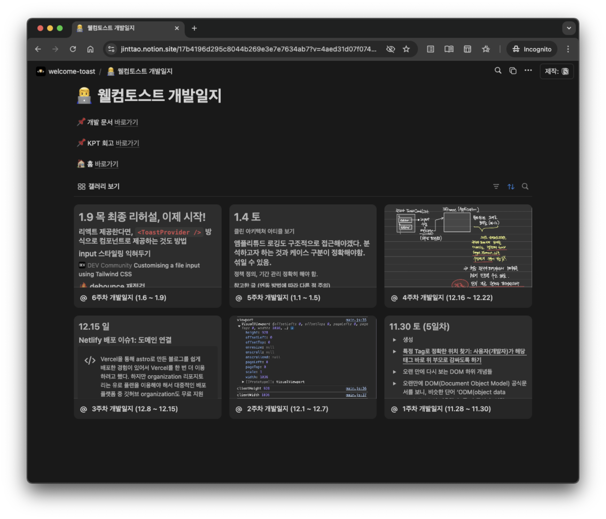
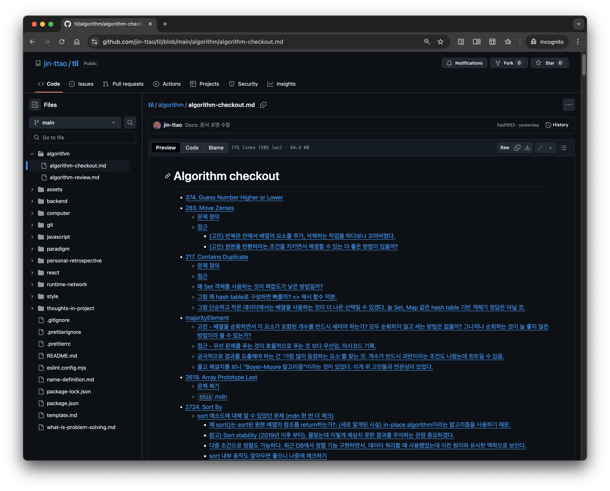
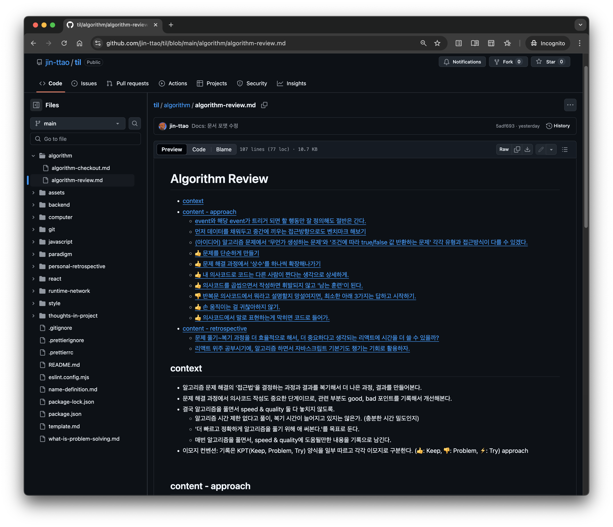

# ⏭️ Jintae's Wiki

## thoughts over theories

> 이론에 의견 덧붙이기\
> 구현 중 의견 남기기

* 학습 내용을 정리하고 있습니다. (2025.01)

## 목차

* [프로젝트 개발일지](./#프로젝트-개발일지)
  * [개인 프로젝트 SDK @welcome-toast](./#개인-프로젝트-sdk-welcome-toast)
  * [팀 프로젝트 - 네이버 블로그 게시물 모니터링 툴, @블로블로](./#팀-프로젝트---네이버-블로그-게시물-모니터링-툴-블로블로)
  * [바닐라코딩 프로젝트 과제 수행하면서](./#바닐라코딩-프로젝트-과제-수행하면서)
* [JavaScript](./#javascript)
  * [비동기 - Promise](./#비동기---promise)
* [React](./#react)
  * [React 공식 문서 - Thinkgin in React](./#react-공식-문서---thinkgin-in-react)
  * [React 공식 문서 - 튜토리얼](./#react-공식-문서---튜토리얼)
  * [React 공식 문서 - 조건부 렌더링](./#react-공식-문서---조건부-렌더링)
  * [React 공식 문서 - 리스트 렌더링](./#react-공식-문서----리스트-렌더링)
  * [JSX 내부에서 자바스크립트 표현식(expression)만 사용 가능한 이유](./#jsx-내부에서-자바스크립트-표현식expression만-사용-가능한-이유)
  * [React Router](./#react-router)
* [알고리즘](./#알고리즘)
  * [알고리즘 풀고 배운 것](./#알고리즘-풀고-배운-것)
  * [알고리즘 풀이 습관 복기](./#알고리즘-풀이-습관-복기)

\



### gg

ghg



###




###




## 프로젝트 개발일지

### 개인 프로젝트 SDK @welcome-toast

[Notion - 개발일지 바로가기](https://jinttao.notion.site/17b4196d295c8044b269e3e7e7634ab7?v=4aed31d07f0748e291c64f6dc732dff7\&pvs=4)\

\_\
[GitHub - 연동 스크립트](https://github.com/welcome-toast/welcome-toast)\
[GitHub - 어드민 페이지](https://github.com/welcome-toast/admin)

\

### 팀 프로젝트 - 네이버 블로그 게시물 모니터링 툴, @블로블로

[문서 바로가기 - Weekly](thoughts-in-project/retrospective-bloblow-weekly.md)\
[문서 바로가기 - Daily](thoughts-in-project/retrospective-bloblow-daily.md)\
\_\
[GitHub - Client](https://github.com/Team-Bloblow/Bloblow-Client)\
[GitHub - Server](https://github.com/Team-Bloblow/Bloblow-Server)

\

### 바닐라코딩 프로젝트 과제 수행하면서

[문서 바로가기](thoughts-in-project/retrospective-react-projectA.md)

* Eat your frog + 지금 내가 모르는 범위가 정확히 무엇인지 글로 정리.
* 내가 사용할 제품 만든다는 생각으로.
* 문제를 잘 정의하는게 얼마나 중요한지.

\
\

## JavaScript

### 비동기 - Promise

[문서 바로가기](javascript/asynchronous.md)

* Promise는 마치 오래 걸리는 작업의 '대변인'이자, 뒷처리 까지 도맡아주는 '행동대장' 같다.
* 비동기 코드의 실행 흐름을 예측하자 (틀림)

\

###

\
\

## React

### React 공식 문서 - Thinkgin in React

[문서 바로가기](react/react-thinking.md)

* 기술적인 사고방식이나 코드의 패턴을 써먹기 전에, 어떤 멘탈 모델을 탑재하면 될지 익히기.
* 공식적으로 권장되는 '리액트를 사용하는 맥락', '관점', 'tip' 등을 확인해볼 것.

\

### React 공식 문서 - 튜토리얼

[문서 바로가기](react/react-opinion-on-official_docs.md)

* 리액트 공식 문서에서 `<React 학습>` 파트를 읽고 의견을 기록한다.
* 진행 현황 (2024.10.23 기준)
  * UI 표현하기 90% (9/10)
  * 상호작용성 더하기 0% (0/8)
  * State 관리하기 0% (0/8)
  * 탈출구 11% (1/9)

\

### React 공식 문서 - 조건부 렌더링

[문서 바로가기](react/react-conditional-rendering.md)

* 컴포넌트 안에서 원하는 컴포넌트의 일부만, 즉 컴포넌트를 구성하는 특정 JSX 조각을 의도에 맞게 보여주거나 가릴 수 있다.
* 이때 렌더링 기준이 될 '조건'이 필요한데, React 공식 문서의 <조건부 렌더링> 파트를 보면서 (1) 조건이라는 것을 명시하는 방법, (2) 그 조건 하에서 무언가 보여주거나 보여주지 않는 방법을 익혀보려고 한다.

\

### React 공식 문서 - 리스트 렌더링

[문서 바로가기](react/react-list_rendering.md)

* 바닐라 자바스크립트를 배우던 시기에, Tic-Tac-Toe 구현 프로젝트에서 여러 개의 div 태그를 구현할 때 동적으로 DOM을 생성해준 적이 있다.
* 더 이 전에는 일일이 HTML로 div를 찍어두었는데, 미리 HTML 코드로 정적 마크업을 만들어두지 않는 편이 좋다. 브라우저가 스크립트를 실행할 때 동적으로 DOM을 만들어주는 것이 몇 개일지 모를 태그를 일일이 만들어주지 않아도 되는 장점이 있다. 무엇 보다 유연하게 대응(e.g. 사용자 입력값 등에 따라 유동적으로 생성) 가능하다는 점도 유용하게 썼던 부분이다.
* 본 문서에서는 자바스크립트에서의 이러한 작업을 당연히 리액트에서도 할 수 있는데, 어떠한 점에서 다른지, 리액트가 어떻게 이 작업을 수행하는지 중심으로 적어보려고 한다.

\

### JSX 내부에서 자바스크립트 표현식(expression)만 사용 가능한 이유

[문서 바로가기](react/react-jsx_only_expression.md)

* 표현식이 값을 반환하는 건 이해했지만, JSX에는 왜 값만 있어야 할까?
* 이유들을 조사해보니 근본적 원인은 이미 배운 개념에 있었고, 새롭게 React & JSX에 접목시켜 이해하는 것이 중요했다.

\

### React Router

[문서 바로가기](react/react-router.md)

* 라우팅 구조, 적용하면서 고민을 기록.
* 사용자의 로그인 여부를 App 컴포넌트에서만 하는게 좋을까, 각 페이지 컴포넌트에서 하는게 좋을까?
* 중첩 라우팅
  * 중첩된 컴포넌트는 동시 렌더링이 되기 때문에 두 컴포넌트에서 정보를 어느정도 공유하는 것 '처럼' 쓸 수 있다.
  * 중첩 라우팅은 순서대로 부모 > 자식 호출될 것을 보장해주나?

\

## 알고리즘

* 알고리즘 연습과정을 구체적으로 기록해본다. 문제를 쪼개고, 생각을 코드로 만들어내는 과정이 어떻게 진행되는지.
*   예시 [majorityElement](algorithm/algorithm-checkout.md#majorityelement)

    > * (고민) 배열을 순회하면서 각 요소가 포함된 개수를 반드시 세어야 하는가? 모두 순회하지 않고 세는 방법은 없을까? 그나저나 순회하는 것이 늘 좋지 않은 방법이라 볼 수 있는가?
    > * (접근) 우선 문제를 푸는 것이 효율적으로 푸는 것 보다 우선임. 의사코드 기록.
    > * 궁극적으로 결과를 도출해야 하는 건 ‘가장 많이 등장하는 요소’를 찾는 것. 개수가 반드시 과반이라는 조건도 나왔는데 힌트일 수 있음.
    > * 풀고 해설지를 보니 "Boyer-Moore 알고리즘"이라는 것이 있었다. 이게 위 고민들과 연관성이 있었다.

\

### 알고리즘 풀고 배운 것

[문서 바로가기](algorithm/algorithm-checkout.md)

\

### 알고리즘 풀이 습관 복기

[문서 바로가기](algorithm/algorithm-review.md)

