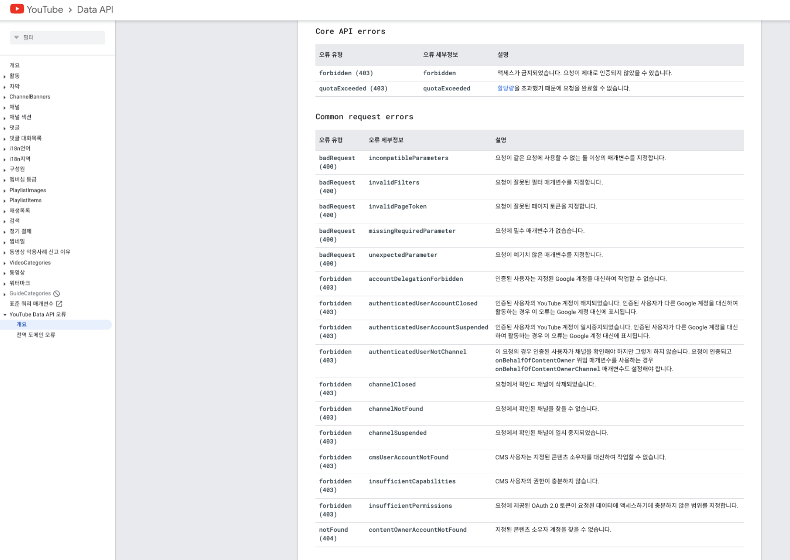
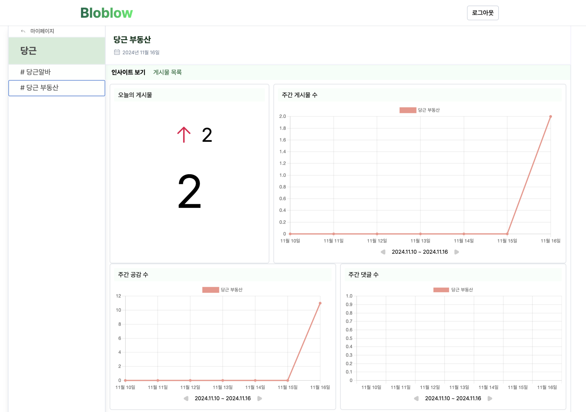
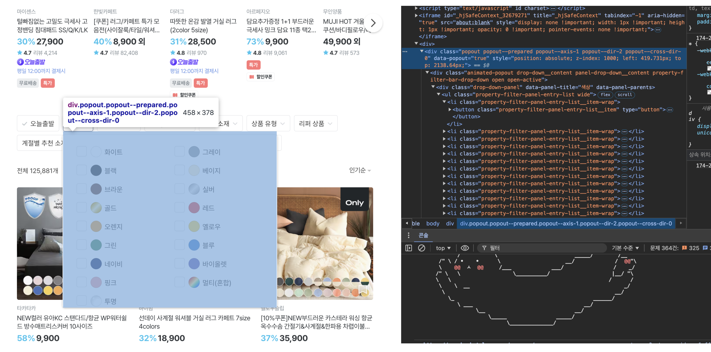
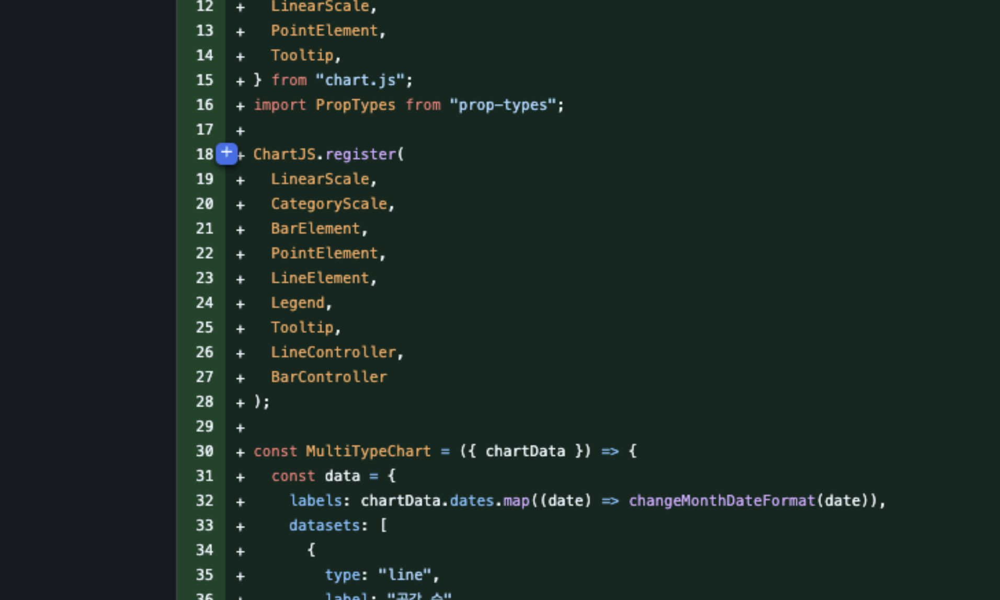

# 팀 프로젝트 Bloblow 회고 Daily 2024-11

## context

* 프로젝트 개요
  * 키워드 기반 네이버 블로그 게시물 분석 툴 BloBlow
  * "키워드를 등록하면, 네이버 블로그 게시물로 올라온 고객 반응 분석을 도와드립니다."
  * https://github.com/Team-Bloblow
* 팀 프로젝트 중 회고를 놓칠 수 없다.
* 프로젝트 진행일정
  * 10.24 \~ 10.28 아이디어 선정, 협업 규칙 결정
  * 10.29 \~ 10.31 PoC
  * 11.01 \~ 11.03 칸반 작업
  * 11.04 \~ 11.19 구현
  * 11.20 프로젝트 1차 종료 및 발표

\


## content

### 공통

* 실력을 키워야 더 솔직하게 커뮤니케이션 할 수 있을 것. 개발 잘 하고 싶은 이유. 내가 아이디어 내는거 다 내가 할 줄 알고 싶고, 알아야 할 것. 내 말에 책임.
* 내 의견만 고집하지 않으려 했다. 다만, 이 태도가 내 책임을 회피하는 건 아닌지 고민도 되었다. 프로젝트가 잘 굴러가는 게 내 의견을 관철시키는 것보다 중요하다고 생각했다. 간혹 이렇게 넘어간 이슈를 결국 다시 논의할 때 이런 고민이 들었다. 앞으로는 좀 더 명확한 기준을 세울 필요도 있겠다 싶다.
  * 어쩌면 내가 해당 의견에 대한 설득력이 부족했었다. 혹은 확신이 부족했거나. 이 중 무엇인지 내가 인지해서 의견을 관철할지, 보류할지 정하는게 필요하겠다.
* 팀원이나 내가 심리적 안정감을 느끼지 못하는 상황을 어떻게 해결해야 할지 고민이다. 단순히 '잘할 수 있다'라고 격려하는 것 말고, 근본적인 해결책이 필요하지 않을까.
* 더 빨리 진행했으면 좋았을 텐데 하는 아쉬움이 남음.
* 일정을 작게 나눠서 최대한 현실적으로 예측했으면 좋았을텐데, 마음이 앞서서 스스로 일정을 촉박하게 잡아 결국 계획한 시간과 소요 시간의 괴리가 컸다.

### 10.30

#### 개발자 사고에 더 익숙해지기 (Action item: 문제 해결 관점, 내가 만든 기능들에 필요했던 세부 단위로 쪼개 보고 복기)

* 기획 단계라서 PM 사고를 더 하는 걸 수 있지만...
* 일정 내에 기능을 만들어야 하는데 요구사항을 충족하기 위해 세부적으로 어떤 기능을 만들어야 하는지 눈에 보여야 일정 산정도 가능할 것.

### 10.31

#### 서로 생각을 일치시키는 과정

* 서로 정의하는 핵심 기능이 달랐다. 블로그 게시물 차트나 리스트가 누구한텐 필수고, 누구한텐 있으면 좋은 거였다.
* 특히 좋은 게시물을 골라내는 기능은 처음엔 모두가 중요하다고 봤는데, 실제로 코드로 어떻게 만들지 며칠간 정의를 못해서 우선순위를 낮추게 됐다.
* 결국 '게시물 리스트'로 좁혔다. 근거는 우리 프로젝트가 차별성을 가질 수 있는 요소가 많은 영역이라는 것. 프로덕트로써 보면 '게시물 차트'가 사용자에게 더 유용할 수 있다. 하지만 차트 구현은 여느 프로젝트에서든 흔히 볼 수 있다.
* 유용한 게시물 선별, 게시물 필터링 등 훙미로운 기능 구현이 가능하고, 추후 고도화 영역이 많았다. 이렇게 켄님과 명재님꼐 조언을 구하면서, 팀원들이 공감하는 방향을 매듭 지을 수 있었다.

#### 나는 프로젝트가 진전될 수 있도록 무슨 노력을 했나?

#### 개념

1. MongoDB, Firebase를 활용한 DB 차이
2. 하나의 웹 어플리케이션에서 Express, Mongoose, React 각각이 무슨 역할을 하게 되나?
3. DB에 쿼리 한다는 것이 무슨 의미일까 [링크](https://www.mongodb.com/ko-kr/docs/compass/current/query/filter/)
4. MongoDB는 왜 Document라는 용어를 쓸까?
5. MongoDB로 구글 소셜 로그인 구현이 가능할까?
6. OAuth와 일반 소셜 로그인 차이가 뭘까?

### 11.02

#### 개념

* schema, subschema, mongoDB <> mongoose 역할 차이 정확하게 이해하기. mongoose에서 populate는 왜 이름이 populate?
* SQL, NoSQL 차이 이해. 각각 DB에 대한 용량 제한.
* HTTP 통신에서 request Content-Type란? application/json 을 명시하는 이유
* URI, end point란?
* 페이지네이션 구현 관련 방식 2가지
  * offset 기반은 limit만 제어해서, ‘데이터 요청할 단위’, 즉 ‘페이지네이션 단위’를 지정하면 되는 것 같다. 아 -> offset도 해줘야 함.
  * Cursor based Pagination(커서 기반 페이지네이션)이란? [링크](https://velog.io/@znftm97/%EC%BB%A4%EC%84%9C-%EA%B8%B0%EB%B0%98-%ED%8E%98%EC%9D%B4%EC%A7%80%EB%84%A4%EC%9D%B4%EC%85%98Cursor-based-Pagination%EC%9D%B4%EB%9E%80-Querydsl%EB%A1%9C-%EA%B5%AC%ED%98%84%EA%B9%8C%EC%A7%80-so3v8mi2)

#### API 정의할 때 URI는 클라이언트에서 “이러한 형식으로 줄게”의 의미로 작성, DB 필드명으로만 구성해야 하는 것으로 착각했음.

#### React Query 상태 관리 라이브러리 사용할거라면 꼭 Zustand도 써야 하나?

* 2가지 상태 관리 라이브러리를 사용하는 것이 처음 들었을 때는 낯설었음. 안쓰고 React Query만으로 클라이언트, 서버 상태를 모두 관리할 수 없나? => 결국 각각 사용목적과 강점이 다름
  1. 각각 사용 목적과 강점이 다름.
     1. React Query: 비동기 기능에는 강하지만, 전역 상태에는 적합하지 않을 수 있음.
     2. Zustand: 전역 상태 관리에 적합하지만, 비동기에 약함.
  2. 클라, 서버 상태를 분리 함 - 참고 [링크](https://www.reddit.com/r/reactnative/comments/1cu1d8c/do_we_need_to_use_zustand_along_with_react_query/) / [링크](https://velog.io/@hyeon9782/%EC%9A%B0%EC%95%84%EC%BD%98-2023-%ED%94%84%EB%A1%A0%ED%8A%B8%EC%97%94%EB%93%9C-%EC%83%81%ED%83%9C%EA%B4%80%EB%A6%AC-%EC%8B%A4%EC%A0%84-%ED%8E%B8-with-React-Query-Zustand)

### 11.03

#### 오늘 비로소 API 의 'I(Interface)'의 의미를 조금이나마 체감했다.

그전에는 왜 인터페이스라는 용어를 쓰는지 감이 안왔다. 프론트엔드는 UI를 보고 코드를 짜고, 백엔드는 API를 보고 코드를 짜서 그런가? 역시 계속 보고 사용해봐야 느낌이 온다.

#### REST API (WIP)

아이패드에 REST API 공부한거도 정리하기. '각 상태를 마치 변수 처럼 관리한다는 포인트'

#### 아직 초기 세팅이 낯선 것 같다. 어떤 순서대로 할지 감 잡아두자.

* 다음 프로젝트 때 초반 시간 아낄 수 있을 방법을 생각해보자.

#### 개념

* 테일윈드를 devDependencies로 해도 되는 이유
  * 정적이라 빌드 때만 필요하다?

#### HTTP 상태 코드 정의방법: 유효성 검사와 헷갈렸던 '서버 에러'의 정의

* 메모) 보통 에러는 어떤 시나리오일때? 형식에 안맞는 요청, 이상한 요청... 로그인 없이 진입, 권한 없는 곳 진입하려고 할때 (화면에 보여서 진입, url 다이렉트 진입)
* 논리적으로 정의하면 될 것. 에러 정의 전에 정상적인 케이스를 육하원칙으로 정의할 것 (누가 언제 무엇을 어떻게 왜 하는지) 이 경우를 총족시키지 않은 것을 에러로 정의하면 되지 않을까?
* 오늘 YouTube Data API 공식 문서의 오류 파트를 보면서 어떻게 작성하는지 이해했다. 결국 중요한 것은 "어떤 상황"인지 최대한 명확하게 기재가 되어야 하는 것 같다. 

#### 프레임워크가 필요한 이유, 단지 편해서?

* 가독성을 위한 건가? 모두가 코드를 다르게 작성하기 때문에 애초에 문법을 구체적으로 정하기 위해 사용되는건가?
* 추가로 그랬을 때 사용가능한 메소드들이 편해서?

### 11.04

#### 우리 프로젝트에서 백엔드가 필요했던 이유를 구체적으로 설명 가능한가?

* db, server, backend 개념 부터 정확히 이해. 지금은 3개가 어떻게 다른지 모른다.
* 참고) 백엔드, 프론트엔드, DB의 역할 [링크](https://brunch.co.kr/@yj5wqu/36) /
* 실무에서 FE / BE 유효성 검사 관련 보면 좋을 글 [링크](https://blog.barogo.io/%EA%B0%9C%EB%B0%9C%EC%9D%B8%ED%84%B4-validation%EC%97%90-%EB%8C%80%ED%95%9C-%EA%B3%A0%EB%AF%BC-532ffb986b64)

#### 개념

* 서버에서의 Route 개념은? Router는 리액트에서만 봤었는데.
* 비동기 fetch
* Express에서 `app`의 의미 (`app.use`, `app.listen`의 역할은?)
* Npx, npm 차이
* Node.js 버전 관련

#### 오늘 시간 오래 걸린 것 => 서버랑 DB 연결하는 것. Express가 웹서버 쉽게 만들게 해주는데 mongoose로 연결이 오래 걸렸음. 근데 Node.js 버전 때문이었음.

#### 로직이 중요하지 라이브러리, 프레임워크는 그 다음 수단이다.

#### 나는 처음 배우는 기술을 어떻게 학습하는게 좋나?

* 결국 내가 처음 배우는 초반에 어떻게 어려움을 빨리 극복하고 터득하는지 보여주는게 성장가능성. 지금 집중해야 한다.
* 친근해지기, 코드로 실험을 빨리 해보고 시각적으로 많이 접해서 익숙해지기, 전체 구조 이해하기, 메소드 이해하기, 파라미터와 리턴값을 이해하기,
* 지금 팀플 시기에 외연 확장을 해놔야 한다. 나는 한 번 사용해본 기술에 금새 친해지는 편이지만, 아직 접하지 않은 기술은 명확한 사용이유가 공감되지 않으면 경계하는 편. 그래야 갠플 때 더 넓은 시야 하에 "제대로" 할 수 있다. 지금 최대한 얕더라도 넓게.

### 11.05

#### 코드리뷰 정확하게 할려면 나도 기본기가 충분해야겠다. 자바스크립트 얕은 비교 너무 중요.

#### 하루에 1시간씩 총 2시간 코드리뷰 버퍼 시간 빼두기.

### 11.06

* 9시반 개발 시작, 새벽 4시 까지 코딩

#### 지금 시각으로는, 백엔드는 어느정도 정석적인 방법이 정해진 것 가은데 프론트엔드는 정답이 없고 많이 유연한 느낌.

* 각자 매력. 프론트는 불확실성이 큰만큼 더 정교하게 다뤄야 해서 매력적이기도 함.

#### 코드 리뷰만 오늘 6시간 가까이 쏟았다. 코드 리뷰 시간을 더 줄일 수 없을까?

다른 사람의 코드를 읽고 이해하기, 내 주장과 근거를 뾰족하게 만들기. 크게 이 2가지에 시간 쏟는게 전부.

* 둘다 경험이 쌓이면 소요시간이 줄겠지만, 그 중 후자는 평소 기본기 탄탄하면 크게 득 볼 수 있을 듯.

#### 나만의 코드 리뷰 요령 정의해나가기

* 여러 파일 중 어떤 파일 부터 보면 좋은지 (어중간한 위계 파일 보다는, 가장 작거나 가장 상위 파일 부터 보는게 거시적인 흐름 파악하기도 좋고, 단순해서 빠르게볼 수 있었다)
* 중요도 높은 파일에 더 많은 시간 쏟는게 맞을까?
* 한치의 오류도 양보하지 않는다는 마인드로 보는게 맞나? 당연한 마음가짐 같은데 리뷰어의 부담이 너무 큰 것 같다.

### 11.07

#### "시간 관리". 생산성이 지금 잘 나오고 있나? 오늘은 무엇에 시간을 많이 쏟았나?

* 내가 실제 구현하는 기능, 범위가 중요도가 높은 것 같지 않다는 생각이 들었다. 현재 까지는 그렇지만 앞으로 다르면 됨. 블로그 필터링 품질을 높일 수 있는 방법을 충분히 고민하고 녹이기.
* 팀 프로젝트에서 내 작업 속도가 가장 느려 피해를 주는 건 아닐까 싶다 => 내 부족한 점을 솔직하게 오픈하고 상황 공유 > 일정과 기대치 공유

#### pull rebase 하지 않고 merge 해서 팀에 차질을 빚음.

#### 매일 기록 못 하고 있다는 것에 아쉬움. (1) 기술적 어려움, (2) 협업 중 어려움을 메모해두자.🙂‍↔️

* 남은 시간 19:20 부터 23:30 까지 4시간 남았다. 제한 시간 안에 모달 UI 끝내고, 테스트 후 수정사항도 업데이트 해야 함. 내가 빨리 기능 쳐야 내가 할 수 있는 범위가 늘어난다. 집중하자. 나에게 이로운 환경을 찾아가서 하자. 소파에서 하더라도.

### 11.08

#### 비슷한 기존 코드 있더라도, 내 생각을 먼저 정의하고 코드 작성할 것

* 어제 `SubkeywordModal`(추가/제외 키워드 편집 모달) 구현을 5시간 가량 투입했다.
* 더 빨리 할 수 없었을까? 처음에는 규경님이 짜신 코드를 거의 그대로 사용했다. 빨리 하는 건 중요하겠지만 알고 써야 한다.
* 하지만 이렇게 작성하다보니 기존 코드 의도 파악, 내가 생각한 구조와 차이가 있다보니 코드를 이해하기에 더 오래 걸렸다.
* 결국 이 기능 대체해서 새롭게 필터 기능을 만들었는데, 기존 코드는 참고만 하고 내 생각으로 0에서 부터 코드를 작성했다. 이 방식이 더 효율적이고, 명확한 의도를 담을 수 있다는 걸 깨달았다.
* 기존의 방식이 늘 옳을리 없다. 내가 주도적으로 생각을 먼저 하고 코드로 반영하자. 기존 방식에 논의가 필요하면 논의할 것.

### 11.10

#### 상태 관리, 렌더링 관련해서 더 많이 리뷰하자. 리뷰 하려면 이것에 대해서 더 공부해야 할 것.

#### 나만의 코드 리뷰 방법

* 커밋을 보고 해당 커밋의 코드를 본다. => 빠른 맥락 파악에 도움이 됨.
* 이건 구조적으로 볼 수 있는 것과 이어짐. 해당 기능 구현을 위해 다른 구조, 다른 논리는 없었을지 고민해볼 수 있게 함.
* 내가 커밋을 할 때도 도움됨. 어떻게 커밋하면 좋을지 생각해보게 됨.
* 커밋 한 문장으로 아래 코드 맥락을 알 수 있도록 하는 것도 능력이다.
* 네이버 기술 블로그 코드 리뷰 관련 글 참고하기

#### 커밋을 중간 중간 해야 하는데 마지막에 한번에 하는 게 좋은 것 같지 않다. 계속 수정사항이 발생하는 것 같아서 그러는데, 다들 어떻게 하나?

### 11.11

#### 개념

* mongoose: `populate` 참조 `ref` 필드를 어떻게 알고 찾아줄까? \[\[mongoose populate 참조]]
* 핵심: 컬렉션 이름을 ref value로 걸어주기, populate 호출할 때 join 필드 설정해주기

### 11.13

#### 예상 시간 보다 아예 3배 이상 잡기

* 앞으로 내가 1차 예상한 시간 보다 3배는 일단 넉넉히 잡아보자. 그리고 시간을 확보하자. 당연히 차라리 시간을 넉넉히 확보하는게 낫다. 🔥

#### 코드 리뷰 관련 고민: 언제 할 수 있을지 팀원에게 계획 알려줘야 작업일정에 참고할 수 있겠다. / 리뷰 전 나도 먼저 로직 구상해보기

* 코드 리뷰 지연되지 않게 하기. 왠만하면 코드 리뷰 먼저 하자. 놓치지 않게 하기.
* 코드 리뷰 할 때 내가 먼저 로직을 대략 구상해보고 PR 올라온 코드를 보는게 낫긴 하다. 여유가 될 때만. 안그러면 알고리즘 정답 보고 문제 푸는 것 처럼 그외 로직을 떠올려서 다른 구조, 로직을 제안하기 쉽지 않다.

#### ROI 따져서 중요한 거에 빨리 집중

지금 중요한 것에 집중. ROI 잘 따져야지, 사소한 것에 깊게 들어가지 않게 주의할 것. 코드 리뷰 보다 개발 시간 절대적으로 확보할 것.

* 초반에 빨리 기능 개발해서 PR을 계속 채우지 않으면 코드 리뷰 스택이 계속 쌓여서 내가 개발할 시간이 무기한 늘어진다. 다른 사람이 개발 빨리 끝나면 나는 그걸 봐줘야 하고, 내 기능 끝나는 시간 그만큼 늦어지고 악순환 주의하기.

#### 백엔드 API 만드는 것도 결국 함수를 만드는 건데 결국. 인풋과 아웃풋이 명확함.

### 11.14

#### React 스타일링 잘 할줄 알아야 하는 나만의 이유: 요구사항 충족, 시간 낭비 방지

* 더 중요한 로직, 기능 구현에 집중할 수 있음.

#### 하위 task 공유했으면 구현기능 범위를 누락하지 않았을 것

* 기능 구현 중 DB 업데이트 기능을 빠뜨려서 추가로 구현함.
  * 검색 버튼 누르면 해당 값을 DB에 대체해줘야 함.
* 회고) 혼자 걷다가 생각함. 하위 task 공유했으면 조금 방지할 수 있을수도. 한 사이클 생각하고 했으면 db 업데이트 해주는 로직 누락 없었을 것.

#### 집중하니까 스트레스가 풀린다. 오후 시간대 밥은 적게 먹기. 밥 먹는 타이밍 쪼개기.

#### 구현 중에도 부족한 부분을 빨리 정의, 인정하고 필요한 질문을 잘 하는 역량도 중요.

* 리액트 쿼리로 이전 프로젝트 경험이 있으심 규경님께 질문 하니 빠르게 감을 잡을 수 있어서 효율적인 학습이 되었다.

### 11.15

* 필터링 UI 얼마나 걸렸나? 대략 8-9시간 걸렸다. 예상은 2-3시간 예상했는데... 왜 오래 걸렸나? 무엇을 캐치하면 시간을 절약할 수 있나.
  * 요구사항 다같이 잘 싱크했으면! 목업, 디자인 부터 잘 싱크하기. 서로 생각하는 필드가 달랐다.
  * 리액트 쿼리 흐름 파악하고 적용하기
  * 스타일링 (CSS, 테일윈드 -> 팀 내 합의된 스타일링 따르는 것도 어려움. flex 잘 활용하기)
  * 성능 최적화 및 버그 수정 (동일 필터링) => 리액트 쿼리 자체를 효과적으로 활용하기 보다 로직적으로 막으려고 했던 것 같음.

### 11.16

#### 주니어 개발자에게 가장 중요한 일 중 하나: 시간 내 주어진 일을 다 마치는 것

* 작업 Estimation의 중요성.
* 뭘 해야하는지 쪼개지 못 하기 때문에 예측이 안되는 거다. 대략 이만큼 걸릴 것 같은데 짐작하는 건 말 그대로 짐작이다.
* 어차피 PR 작성할 때 흐름 설명해야 한다. 구현 전 부터 짜는 연습하자.
* 템플릿 짜두면 편할 것.

#### 크롤링, 차트, 게시물 목록 기능이 얼추 구현되고 당근알바 검색해봄. 실제 문제 해결 한 경험을 해본 것. 짜릿하다.



#### 아이디어) 현재 에셋 뭐가 있는지 한 판 볼 수 있으면 좋겠다. 변수명 만으로는 알기 힘듦. 코드 상으로도 알 수 없고.

#### 다른 서비스 참고하면서 스타일링 참고하는 것도 좋은 방법이겠다.

* 

#### 유저가 많을 때는 에러를 어떻게 확인하는지 궁금하다. 지금은 유저가 없어서 우리 자체가 확인하지만.

#### 개념

* yml 파일 형식은 굳이 왜 있나, pug도.. html, css, js로 충분하지 않나? 아직 세계관이 좁은 듯. 다른 언어, 형식의 존재 의미 궁금.

#### 컴포넌트라 리랜더링 된다고 상태가 초기화 되는게 아니다. 초기화는 처음 한 번 실행되고, 그 다음 리렌더링 되도 상태는 계속 기억된다. 헷갈리지 말 것.

#### 상태는 언제 사라지나?

### 11.18

*   이렇게 useEffect 안에 없는 값 keywordId 를 의존성 배열에 넣어도 괜찮은가. 아니면 의도적으로 넣는 것이 맞는 관습일 것으로 추측된다.

    ```js
    useEffect(() => {
      if (hasPostResponse) {
        console.log("데이터 있음!");
        setHasPost(true);
      }
    }, [keywordId, hasPostResponse, setHasPost]);
    ```

#### 코드 리뷰 할 때 각 컴포넌트가 어떤 관계인지 충분히 알고 있다면 코드리뷰 하기 좋겠다.

#### 이렇게 한다고 어떻게 라이브러리 메소드들을 쓸 수 있게 되는건가? 인스턴스로 인한 것인가?



### 11.19

#### 정렬 기능 구현할 때 가장 중요한 건 동점이 없도록 하는 것. 정렬 기준 여러개 사용할 수도 있어야.

#### 개념

* 포트를 맞춰준다는 건, 입/출구 맞추는 개념. 원리 더 이해 필요.

### 11.20 발표

#### 좀 더 여유가 생겨야 한다. 자신감도. 스스로 자신감 가질 것.

### 11.21

#### 로그인 인증상태 지속성 관련

* Firebase로 OAuth 로그인 구현했다. 로그인 인증상태는 기본값이 local 이라고 하는데, 새로고침 할 때 마다 로그인 풀렸다. Web 환경에서 로그인 안풀리게 하려면 추가로 해줘야할 게 있을지 확인해봤다.
  * 참고한 문서 https://firebase.google.com/docs/auth/web/auth-state-persistence?hl=ko
* 공식 문서에 따르면, 기본값이 local 인데 왜 setPersistence(auth, browserLocalPersistence) 등의 추가 작업 이 필요할까?
* 우선 기본값이 로컬이고 우리도 별도 `setPersistence` 로 인증상태 지속성을 변경해주지 않아서 이미 로컬로 설정이 된 방향이라고 생각한다. [참고문서](https://firebase.google.com/docs/auth/web/auth-state-persistence?hl=ko)
* (개발자 도구 보면 `firebaseLocalStorage` 에도 값도 잘 들어옴)다만 왜 새로고침 해도 로그인이 풀리는지는 설정 중 빠진게 있는지, 추가 설정 필요한지 점검부터 해보자.
