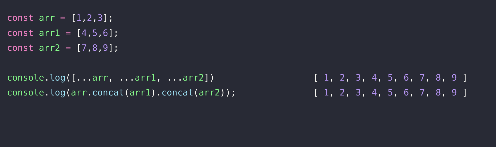

# Method

## context

* 한 번 사용한 메소드는 언제 왜 사용하는지, param, return, 주요 키워드를 반드시 기억한다.
* MDN 공식 문서을 주로 참고하여 spread 해본다.

## content

### Array

#### 배열에 이게 들어가 있을까? (다양한 맥락, 다양한 return 값 활용 가능)

* 직간접적으로 활용 가능한 메소드가 다양하다. `forEach()`, `map()`가 유사한 점이 있으면서도 사용하는 맥락이 다르듯이, 다른 사람이 내가 활용한 메소드만 보고도 문제해결 로직의 의도를 유추해볼 수 있게끔 '맥락에 맞게' 선별해서 사용하자.
* index를 찾고 싶을 때 `findIndex(콜백함수)`
  * param: 콜백 함수 필수.
    * 없으면 `Error: undefined is not a function` 확인됨.
  * return: 콜백 함수 조건을 통과한 The index of the first element (or -1)
*   아래 내용들 참고해서 정리.

    > * If you need to find the index of a value, use indexOf(). (It's similar to findIndex(), but checks each element for equality with the value instead of using a testing function.)
    > * If you need to find if a value exists in an array, use includes(). Again, it checks each element for equality with the value instead of using a testing function.
    > * If you need to find if any element satisfies the provided testing function, use some().
    > * If you need to find all elements that satisfy the provided testing function, use filter().

#### 배열 요소를 바꾸고 싶다 (메소드가 실제 '변경'으로 동작하는 것 이해하기)

*   `fill()` 메소드도 단순 빈 공간 채우기가 아니라, '변경'의 역할. "그 자리에 뭐가 있든 이걸로 fill 한다"의 의미.

    > 공식문서
    >
    > * Array 인스턴스의 fill() 메서드는 배열의 인덱스 범위 내에 있는 모든 요소를 정적 값으로 변경합니다. 그리고 수정된 배열을 반환합니다.

#### sort()

* sort()도 원본에 영향을 준다. 그 정렬된 원본이 반환되는 것이라, 복사본이 반환되는 것이 아님을 기억하자.

```js
// bad
const arrSorted = arr.sort((a, b) => a - b);
// good
const arrSorted = [...arr].sort((a, b) => a - b);
```

#### `reduce()`

***

**reduce() 메소드 중간에 멈추기: `break;` 는 당연히 안됨.**

* 누적 연산하다가 중간에 참조하는 배열에 변경 일으켜서, 더 이어서 연산할 요소를 없애버리기 (샘플 코드 첨부)
* (참고) 자바스크립트 reduce() 에 break 거는 법 [링크](https://inpa.tistory.com/entry/JS-%F0%9F%9A%80-reduce-break-%ED%95%98%EB%8A%94-%EB%B2%95-How-to-early-break-reduce)

```js
const sum = [1, 2, 3].slice(0).reduce((acc, current, i, arr) => {
  if (i === 1) {
    // index 1 차례에서,
    console.log(arr); // 아직 [ 1, 2, 3 ] 생존.
    arr.splice(0); // 참조되는 arr 배열이 reduce 동작 중간에 영향 받음.
    console.log(arr); // splice 때문에 arr는 [] 됨.
  }

  return (acc += current);
  // index 0, 1 까지는 arr 배열 살아있음. 이제 돌 요소 없으니 끝남.
});

console.log(sum); // 3
```

#### `slice()`: 복사

***

#### `splice()`: 삭제, 교체, 추가

***

> The splice() method of Array instances changes the contents of an array **by removing or replacing** existing elements and/or **adding** new elements in place.

\


#### `reverse()` 배열의 요소 반전.

***

* param: 없음.
* return: 순서가 반전된 배열.

\


#### 참조하는 배열을 특정 조건으로 검사해서 Boolean값을 반환하고 싶을 때 사용하는 `Array.prototype.some()` vs `Array.prototype.every()`

***

* some(): 참조하는 배열의 모든 원소가 콜백 함수를 하나라도 만족하는지 검사,
  * param:
  * return:
* every(): 모든 원소가 만족하는지 검사할 때 사용.
  * param:
  * return:

\


#### 배열간 합치고 싶다면, `spread operator(...)` or `concat()`



### Object

\


### Map

\


### Set

\
