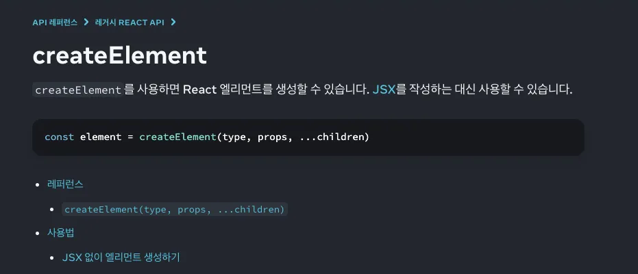
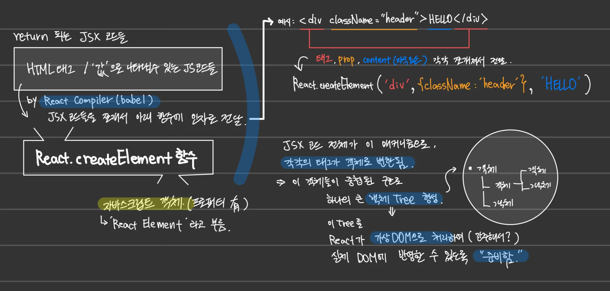
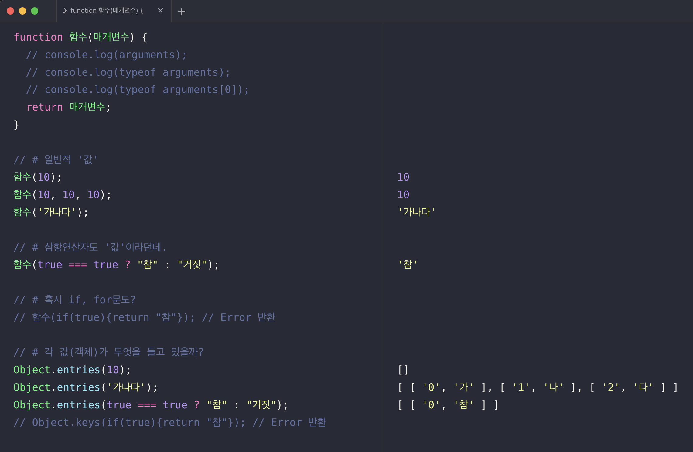

# react-jsx\_only\_expression

## JSX 내부에서 자바스크립트 '표현식(expression)'만 사용 가능한 이유

### Context

#### 표현식이 값을 반환하는 건 알겠다, JSX에는 왜 값만 있어야 할까?

* 이유들을 조사해보니 근본적 원인은 우리가 이미 배운 개념에 있었고, 새롭게 React & JSX에 접목시켜 이해하는 것이 주요했음.

### Opinion

\


### Learned

#### 1/ 개념적 관점: React의 역할, 마크업을 위한 JSX.

1. JSX는 마크업을 위해 결국 HTML '값'을 반환해야 함. 그 자체로 '값'으로 볼 수 있는 코드(표현식)를 JSX는 그나마 유연하게 허용해줌.

* 참고: [마크업은 프로그래밍(연산)과 무관하다](https://www.inflearn.com/pages/infmation-61-20230404?srsltid=AfmBOopT8EFOr_fAI1bo2W6wUF8qtRpbVef4QiTOYcfRbnag8Gwey6Pb) 

2. React는 주문만 받고 요리는 하지 않는 ‘웨이터’. 개발자에게든, 사용자에게든 주문(value, event)을 받기만 하고 직접 지지고 볶고(연산, statement) 하지 않음. 여기서 받은 대로 저기로 전하기만 할 뿐임. %20%EC%95%88%ED%95%98%EA%B3%A0%20%EC%A0%84%EB%8B%AC%EB%A7%8C%20%ED%95%98%EB%8A%94%20%EB%A6%AC%EC%95%A1%ED%8A%B8)

#### 2/ 문법적 관점 : `React.createElement`함수 인자로 전달 될 수 있는 것만 가능.

```
// 컴포넌트 모양새

ㄴ return (JSX)
	ㄴ Markup (태그, props... -- {JavaScript}로 JS도 활용)
```

컴포넌트가 return 하는 JSX 코드들은 모두 잘게 쪼개져, 어딘가 함수의 ‘인자’로 전달됨. (인자 자격 필수) 여기서 ‘어딘가 함수’가 `React.createElement` 임. 순서는 아래와 같음.

1. JSX 코드로 컴포넌트 호출(렌더링)
2. React 컴파일러 ‘BABEL’: “아 JSX 코드들`React.createElement` 함수 인자로 다 넘겨야지\~”
3. `React.createElement` 함수: “ㅇㅋ. 다 자바스크립트 객체로 내보낸다?”
4. 다 객체로 내보내지면, 이것들이 쌓여서 자바스크립트 객체 덩어리(가상의 객체 트리) 구성
5. 리액트: “이제 나서봄. 뭐라도 바뀌면 실제 DOM 반영 준비해볼게”

* 참고 [공식 문서 createElement 함수](https://ko.react.dev/reference/react/createElement)
* 



* 실험 내용

\


## Details

#### Statement(문) vs Expression(표현식) 차이

> A statement does something. An expression evaluates to a value.

* 작업 수행하는 코드 vs 값을 내는 코드
  * 
* 참고) expression은 statement의 일부 ([링크](https://shoark7.github.io/programming/knowledge/expression-vs-statement))
  * expression들은 평가(evaluate)가 가능해서 하나의 ‘값’으로 환원된다
  * **statement는 ‘진술’, ‘서술’의 의미로 프로그래밍에서는 실행가능한(executable) 최소의 독립적인 코드 조각.**
    * **statement는 흔히 한 개 이상의 expression과 프로그래밍 키워드를 포함하는 경우가 많다.**

#### JSX “마크업 하고 싶어! (HTML 반환하고 싶음)”

* JSX를 ‘Javascript Syntax eXtension’ 혹은 ‘JavaScript to XML’ 의 약자로 보는 시선도 있음.
* 결국 JSX는 마크업을 위한 수단이므로, JSX 코드를 실행하면, **결과로 'HTML'이 남아야 함.**
* 핵심은 HTML Node의 '값(value)'을 반환하는 것.
  * JS가 데이터 타입 등 유연하듯, JSX도 유연한 부분이 있는데 바로 '값(value)을 결정할 수만 있는 코드면 허용' 해준다는 것임. (표현식은 JSX의 목표인 '값을 결정'하는 데에 도움을 주기 때문)
* 참고 https://stackoverflow.com/questions/60988649/why-can-you-only-use-expressions-in-jsx-not-statements

#### (반론) 중간에만 조건문 쓰고, 결과적으로 값만 반환할 수 있으면 안돼요?

*   예시: if 조건문 vs 삼항 연산자 차이

    * statement(문)을 쓰면? (if 조건문, for 반복문 등) ⇒ 코드 샌드박스 바로가기 https://codesandbox.io/p/sandbox/qdd487

    ```jsx
    // 반환 값이 없음
    if (value) {
      변수 = 10;
    } else {
      변수 = 7;
    }

    // (반문) 아니, return을 넣어야죠! => return은 '함수'에서 쓰이지 않으면 쓸모가 없음.
    // MDN "return은 (1) 함수 끝내거나, (2) 함수 반환값 정하는 2개 역할만 함."
    // https://developer.mozilla.org/en-US/docs/Web/JavaScript/Reference/Statements/return
    function 함수(숫자1, 숫자2) {
      if (숫자1 > 0 && 숫자2 > 0) {
        return 숫자1 * 숫자2; // 이 return의 주인은 함수지, if 가 아님.
      }
      return 0;
    }
    ```

    ```jsx
    // 반환 값이 있음. 이 자체가 '값'임.
    변수 = value === true ? 10 : 7;
    ```

#### JSX 안에서 statement를 못 쓴다고 React에서 조건문, 반복문 등을 활용하지 못하는 거 아님.

* 가령 조건부 렌더링을 구현할 때 삼항연산자, map() 메소드로 충분하지 않을 수 있음.
*   이때는 jsx 바깥에서 js 문법으로 연산 하고 결과(값)를 jsx에 가져와서 쓰면 됨.

    ```jsx
    let 버튼;
    if (value) {
      버튼 = <LogoutButton />;
    } else {
      버튼 = <LoginButton />;
    }

    return (
      <nav>
        <Home />
        {버튼}
      </nav>
    );
    ```
*   혹은 정말 JSX 안에서 IF 문 꼭 써야겠다? ⇒ 즉시 실행 함수로.

    * https://javascript.plainenglish.io/iifes-can-change-the-way-you-write-the-useeffect-hook-in-react-a5cb5d69d14a
    * https://velog.io/@rmaomina/IIFE-in-react

    ```jsx
    function App() {
      return (
        <div className="App">
          <h1>If statement with IIFE</h1>
          <div>
            {(() => {
              // 여기 보세요.
              if (true) {
                return "Wow!";
              } else {
                return "Boo";
              }
            })()}
          </div>
        </div>
      );
    }
    ```
