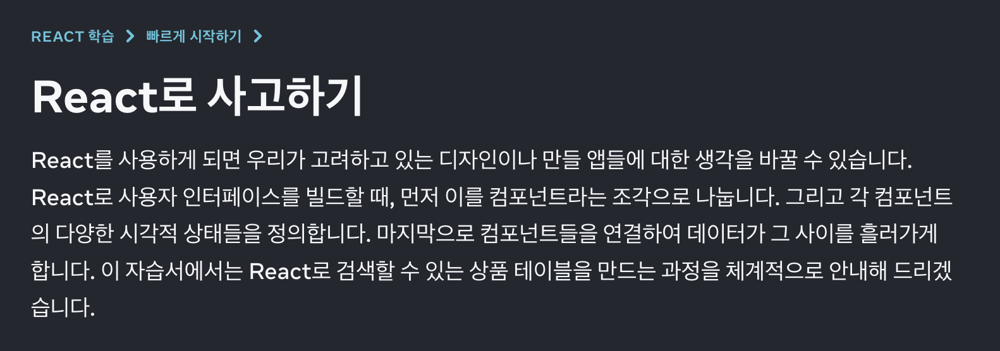

# react-thinking

## React Thinking

## Context

* 기술적 프레임워크를 써먹기 전에, 사고적 프레임워크를 세팅.
* 리액트 라이브러리를 본격적으로 적용해보기 앞서, 공식적으로 권장되는 '리액트를 사용하는 맥락', '관점', 'tip' 등을 싱크하기 위함.

\

* 원문: https://ko.react.dev/learn/thinking-in-react

\

## Opinion

#### 왜 ‘최소한’의 state를 권장할까? 🤔

* 불필요한 state를 두지 않는 것이 좋다는 관점 외에도, 데이터 정합성 측면에서도 중요하겠다.
* 결국 상품 아이템이라는 동일 대상의 이름과 개수인데, 각각 관리된다는 것은 각각 다른 데이터 상태가 될 수 있음을 의미함.
* 결국 데이터 동기화가 안되는 등의 통제범위를 벗어나는 예외적 상황이 생길 수 있음.
*   권장사항 처럼 #2 데이터를 #1 배열의 길이를 그대로 가져오면, 둘 간의 데이터가 어긋나는 상황을 방지할 수 있을 것.

    > 확인한 내용: ...

#### 필요한 state 정의 먼저 하고, 활용할 컴포넌트를 지정한다는 접근 👍

* 컴포넌트를 찍고, 그 안에 필요한 state를 정의하는게 아님.
* 필요한 state를 정의하고, 이걸 활용한 컴포넌트를 지정하는 것이 '리액트적 사고'가 권장하는 순서.
* 기능이나 컴포넌트 등의 작은 단위가 아니라, 애플리케이션 단위로 거시적으로 본다는 의미에서 좋은 접근인 것 같다.

\

## Learned

### Intro

> React로 사용자 인터페이스를 빌드할 때, 먼저 이를 컴포넌트라는 조각으로 나눕니다. 그리고 각 컴포넌트의 다양한 시각적 상태들을 정의합니다. 마지막으로 컴포넌트들을 연결하여 데이터가 그 사이를 흘러가게 합니다.

* 출처 React 링크
* 추가로 보기 : The Best Approach To Design React Component Hierarchy 링크 (검색 키워드 react component structure diagram)

\

> 👇 Template
>
> * 함수(Component): \_\_\_\_
> * return값(Component의 시각적 상태): \_\_\_\_
> * return값 결정기준(State): \_\_\_\_
> * 연결되는 함수(Component 연결 관계): \_\_\_\_
> * 필요 데이터(Props): \_\_\_\_

\

React가 갖는 2개의 데이터 “모델” (둘의 성격은 매우 다름) 더 채우기

1. props: 함수한테 동작에 쓰라고 전달할 데이터 (\*함수 동작의 재료가 됨)
2. state: 함수한테 기억하고 있으라고 할 데이터 (\*함수 동작의 과정 or 결과로 인해 영향을 받음)

\

### Step 1: UI를 컴포넌트 단위로 쪼개기 (Don't code yet.🙅)

> 이름 붙이기: 모든 컴포넌트, 주변 박스들에게 이름 붙여보기 (디자이너 분들이 이미 디자인 툴로 컴포넌트 별 이름을 지정해두었을 수 있으니 먼저 물어보기)

#### 컴포넌트 쪼개기 결과 sample

계층 구조 정리: 모든 컴포넌트는 서로 연결될 수 밖에 없고, 따로 빠져있는 컴포넌트는 없음. 한 컴포넌트 안의 다른 컴포넌트는 자식으로 표현됨.

예시 첨부

1. FilterableProductTable(회색): 전체 포괄.
   1. SearchBar(파란색): 사용자 입력 받기.
   2. ProductTable(라벤더색): 데이터 리스트 보여주고, 사용자 입력 기반으로 필터링.
      1. ProductCategoryRow(초록색): 각 카테고리 헤더 보여주기
      2. ProductRow(노란색): 각각의 제품에 해당하는 행 보여주기

#### 컴포넌트 쪼개기 방법들

* Programming 관점
  * 함수, 객체 만들듯이 ‘단일 책임 원칙’ 반영
  * 컴포넌트는 (이상적으로) 한 번에 한 가지 일만 해야 함.
  * 컴포넌트가 언젠가 커진다면 작은 단위로 또 쪼개져야 함.
* CSS 관점
  * 클래스 선택자로 무엇을 만들지 기준으로 쪼개기 가능.
* Design 관점
  * 디자인 단위를 어떤 식으로 구성할지 기준으로 쪼개기 가능.

#### 컴포넌트 쪼개기 Tips

* UI와 데이터 모델을 매칭해보기
  * JSON, 즉 가져다 쓸 데이터가 잘 구조화 되어있다면, 종종 이렇게 데이터 모델(e.g. JSON)이 자연스럽게 UI 컴포넌트 구조와 대응 될 수 있음. ❓ 왜냐하면, UI와 데이터 모델은 ‘같은 구조’(같은 Information Architecture)를 가지기 때문. (+ ??) 👉 그러니, UI를 컴포넌트로 쪼개고, 각 컴포넌트가 데이터 모델에 매칭될 수 있도록 해야 함.
* 컴포넌트를 쪼갤지 말지는 결국 자신의 선택 (단, 이유는 명확하게)
  * 단순한 기능이면 상위 컴포넌트에 포함시켜서 굳이 분리하지 않도록 해도 됨. 하지만 단순했던 기능이 복잡해지면, 분리하는 것이 더 합리적일 수 있음. 이것도 자신의 선택.

\

### Step 2: React로 정적인 버전 구현하기 (Code Start!💥)

> 단순 JSX만 리턴하도록 함수(Component) 채우기 시작 아직 state 값 쓰지 말기. 다음 단계에서 사용.

* “선 정적, 후 상호작용” 가장 쉬운 접근 - 상호작용 기능은 추가하지 않고, 데이터 모델을 참고해서 UI를 렌더링 하는 버전을 만드는 것이 쉬움. 이때 먼저 ‘정적인 버전’을 만들고, 이후 상호작용 기능을 추가하기. - 정적 버전을 만들 때 많은 타이핑이 필요하나 생각할 것은 적고, 상호작용 기능은 완전히 반대임. (…) 더 채우기 Compoent 함수의 파라미터로 받은 인자를 가공해서 return JSX 에 적극 활용하기.

결국, 정적인 버전 구현 끝나면 ‘재사용 가능한 컴퐅넌트들의 라이브러리’가 모두 준비됨. 아직 정적 버전이라, Compoent 함수는 단순히 JSX만 리턴할 것.

* 최상단 component는 prop으로 데이터 모델을 받음. 이때 데이터가 최상단 부터, 트리의 맨 아래 까지 흘러가기 때문에 ‘단방향 데이터 흐름’이라고 부름. 🔥

### Step 3: ‘최소한’의 데이터만 이용해서 ‘완벽’하게 UI State 표현하기&#x20;

> UI를 상호작용 하게 만들려면, 사용자가 기반 데이터 모델을 변경할 수 있게 해야 함. React는 state를 통해 기반 데이터 모델을 변경할 수 있게 함. state는 (앱이) ‘기억’해야 하는 + ‘변경’할 수 있는 데이터의 ‘최소’ 집합이라고 생각하기.

‘최소’ 집합은 남발하지 말자?의 의미?

#### state 정의할 때 중요한 점

* “기억해야 하는”:
  * 함수 실행이 끝나면 결과가 증발하는 일반 변수가 아니라, 함수 실행 끝나고도 데이터가 유지되는 상태 변수를 써야 함.
* “변경할 수 있는”:
  * 변경할 수 있는 것의 의미는 이해했지만, ‘무엇에 의해’ 변경이 되는지 명확하게 해야겠다.🔥
* 중복 배제 원칙 (Don’t Repeat Yourself): state 구조화 할 때 중요함.
  * 앱이 필요로 하는 ==가장 최소한의 state, 즉 ‘기억해야 하고, 변경할 수 있어야 하는 데이터’는 무엇인지 정의 부터 시작하기.== 그외 나머지 모든 것들은 (필요에 따라) 일반 변수, 혹은 이미 만든 state 토대로 실시간 계산해서 사용하기.
  * 가령 <쇼핑 리스트> 만들 때 아래 데이터 예시 중, state 값으로 가져야만(must) 하는 것은?: #2 는 #1 데이터 배열의(개수를 따로 state 값으로 갖지 않기)
    * 데이터 #1: 상품 아이템 이름 (‘배열’이라고 가정)
    * 데이터 #2: 상품 아이템 개수
  * (추가 의견 메모) 왜 ‘최소한’의 state가 필요할까?: 불필요한 state를 두지 않는 것이 좋다는 관점 외에도, 데이터 정합성 측면에서도 중요하겠다. 결국 상품 아이템이라는 동일 대상의 이름과 개수인데, 각각 관리된다는 것은 각각 다른 데이터 상태가 될 수 있음을 의미함. 결국 데이터 동기화가 안되는 등의 통제범위를 벗어나는 예외적 상황이 생길 수 있음. 권장사항 처럼 #2 데이터를 #1 배열의 길이를 그대로 가져오면, 둘 간의 데이터가 어긋나는 상황을 방지할 수 있을 것.

#### state 가 될 수 있는 조건

1. 필수 기억
2. 변경 가능 (고정 아님) - 시간이 지나도 변하지 않나요? 그러면 확실히 state가 아닙니다.
3. 다른 곳으로부터 전달되는 것이 아님 - 부모로부터 props를 통해 전달됩니까? 그러면 확실히 state가 아닙니다.
4. 다른 데이터로 계산 불가 - 컴포넌트 안의 다른 state나 props를 가지고 계산 가능한가요? 그렇다면 절대로 state가 아닙니다! 그외 남는 건 아마 state일 것임! (공식 문서 예시로 또 보기)

#### state 결정 타이밍

* (추가 의견 메모) 컴포넌트를 찍고, 그 안에 필요한 state를 정의하는게 아니라 필요한 state를 정의하고, 이걸 활용한 컴포넌트를 지정하는 순서를 의미하는 듯 하다. 기능이나 컴포넌트 단위가 아니라. 애플리케이션 단위로 거시적으로 본다는 의미에서 좋은 접근인 것 같다.
  * (공식 문서 발췌) 이제 앱에서 최소한으로 필요한 state를 결정했습니다. 다음으로는 어떤 컴포넌트가 이 state를 소유하고, 변경할 책임을 지게 할 지 정해야 합니다. React는 항상 컴포넌트 계층구조를 따라 부모에서 자식으로 데이터를 전달하는 단방향 데이터 흐름을 사용하는 것을 기억하세요! 앱을 구현하면서 어떤 컴포넌트가 state를 가져야 하는 지 바로 명확하지 않을 수 있습니다. 이 개념이 처음이라면 더 어려울 수 있습니다. 그러나 아래의 과정을 따라가면 해결할 수 있습니다.

\

### Step 4: State가 어디에 있어야 할 지 정하기&#x20;

> (최소한으로) state 만들고, 이제 주인(컴포넌트) 찾기. 주인은 해당 state를 소유하고, 변경할 책임을 지게 됨. (주의) React는 ‘항상’ 데이터는 단방향으로 흐름: 컴포넌트 계층구조에 따라 부모 > 자식으로 데이터 전달만 가능. (자식 > 부모, 자식 <> 자식도 불가)

* (읽기 연습) 컴포넌트와 prop 구조를 아래 처럼 말로 설명할 줄 알아야 함.
  * “SearchBar 컴포넌트가 filterText와 inStockOnly props를 table, input과 체크 박스를 렌더링하기 위해서 읽고 있습니다. 예를 들면, SearchBar input의 value를 아래와 같이 채우고 있습니다. 그러나 아직 사용자의 키보드 입력과 같은 행동에 반응하는 코드는 작성하지 않았습니다. 이 과정은 마지막 단계에서 진행할 예정입니다.”

\

### Step 5: 역 데이터 흐름 추가하기&#x20;

> React’는 항상’ 단방향 데이터 흐름이지만, 역으로 자식(선언부) > 부모(호출부)로 거슬러 줘야 하는 경우도 있음. 왜? 바로 ‘사용자 입력에 따라 state를 변경하기 위해서’임. How?: 자식 컴포넌트에 이벤트 핸들러 추가해서,

왜?: 아래 이미지 상태에서 입력창에 ‘fruit’ 입력해준 건, 코드로 해준 것이고, 실제 입력창에서 키보드로 입력해보려고 하면 안됨. 이걸 해주려면, 부모 컴포넌트(호출부)에서 이벤트 핸들러?를 onChange로 해줘야 함.

* (공식 문서 발췌 - 아래 이미지와 같이 보기) 4단계의 예시에서 체크하거나 키보드를 타이핑할 경우 UI의 변화가 없고 입력을 무시하는 것을 확인할 수 있습니다. 이건 의도적으로 `<input value={filterText} />`로 코드를 쓰면서 **value라는 prop이 항상 `FilterableProductTable`의 `filterText`라는 state를 통해서 데이터를 받도록 정했기 때문**입니다. `filterText`라는 state가 변경되는 게 아니기 때문에 input의 value는 변하지 않고 화면도 바뀌는 게 없습니다. 

가령, (입력이 발생하는) 하단의 자식 컴포넌트(선언부)에서 상위 부모 컴포넌트(호출부)의 state를 업데이트 할 수 있어야 함. (왜?: state 변수는 최상위 부모 컴포넌트에서 선언해줬고, 자식은 prop으로 전달 받았기 때문)

* 도식화 해서 짜두면 직관적일 듯 🔥 
