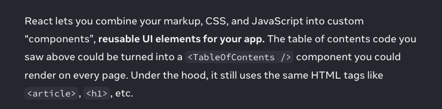

# 컴포넌트

### 컴포넌트라고 해서 항상 재사용해야하는 건 아닐 것. 재사용도 맥락에 따라 선택.

리액트 공식 문서에서도 컴포넌트를 이렇게 정의한다.

1. **마크업, CSS, JavsScript 를**
2. 앱의 ‘재사용 가능한(reusable)’ UI 요소로
3. 사용자 정의 “컴포넌트”로 결합가능

마크업, CSS, JS 이 3가지 즉 “마크업, 스타일, 상호작용”을 묶어둘 필요가 있으면 컴포넌트가 될 수 있음. 워딩이 ‘재사용 가능한’이므로 이건 본인의 선택사항일 것이다.

\

### 모든 버튼 관련 컴포넌트를 하나의 Button 공통 컴포넌트로 재사용 가능한가?

버튼의 기능적 역할은 비슷하겠지만, 스타일이 달라서 재사용 못하는 경우가 꽤 많았다. 이걸 고려해서 만들어두지 않으면 구현이 바쁜 시기에 공통 컴포넌트를 수정하거나 새로 만들고 테스트하고 검증하는 과정이 부담스러웠다. 검증에 품이 많이 들고, 리스크를 지는 선택을 피하고 싶기 때문. 실제로 내가 구현하면서, 동일한 버튼(예시)이지만 Button 컴포넌트를 재사용하지 않고 구현한 것은 없는지 체크해보자.

\

### 생각) 추상화도 결국 문제를 해결하는 수단.

낮은 유연성과 확장성을 가진 컴포넌트를 보고, 항상 문제라고 볼 수 있을까? 잠재적 문제의 원인이 될 수 있지만, 상황에 따라 다를 것. 과도한 추상화를 경계해야 할 필요도 있을 것이다.

\

### 생각) 반복을 피하기 위해 추상화를 시도하는 것은 가장 쉬운 선택이 될 수 있을 것. 추상화를 가능한 미루는 것도 방법이 될 것이다.

눈에 보이는 반복되는 코드를 정리하는 차원이 유의미하긴 하지만, 이것이 가져오는 부작용도 trade-off일 것이다.

예를 들어 중복된 코드를 묶어 하나의 함수로 만들었는데, 나중에 새로운 요구사항이 생기면 어떡할까? 또 선택할 수 있는 옵션이 있을거다. 기존 추상화를 유지하거나 버리거나. 유지하더라도 새 요구사항에 대응해야 하기 때문에 당연히 기존 함수에 파라미터를 추가하든, 비동기 외에 동기 처리를 하는 로직을 추가하든 변형을 가해야 한다.

이렇게 단순한 공통 기능을 처리하는게 아니라, 다양한 엣지 케이스를 처리하는 무거운 코드가 될 수도 있다. 이미 많은 시간을 들여 컨텍스트가 쌓인 함수를 버리고 다시 시작하는 것도 심리적으로 쉬운 선택은 아니다.

https://velog.io/@clydehan/%EC%A2%8B%EC%9D%80-%EC%B6%94%EC%83%81%ED%99%94%EC%99%80-%EB%82%98%EC%81%9C-%EC%B6%94%EC%83%81%ED%99%94

\

### 발췌) 좋은 코드란 반복이 적은 코드가 아니라, **요구사항을 정확하고 빠르게 반영하고/할 수 있는 코드**임을 항상 명심해야합니다.

https://pgo-dev.medium.com/%EC%B6%94%EC%83%81%ED%99%94%EB%9E%80-%EB%AC%B4%EC%97%87%EC%9D%B8%EA%B0%80-bb8f3e6a8a1d
